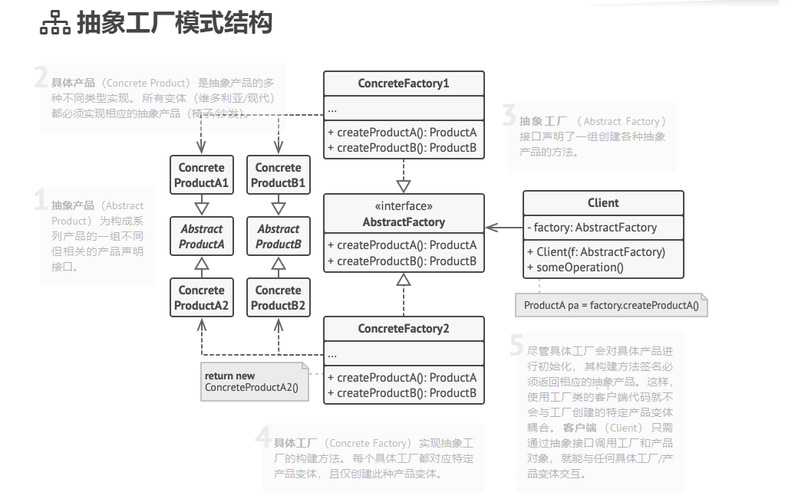

> 抽象工厂模式是一种创建型设计模式， 它能创建一系列相关的对象， 而无需指定其具体类。
抽象工厂定义了用于创建不同产品的接口， 但将实际的创建工作留给了具体工厂类。 每个工厂类型都对应一个特定的产品变体。

在创建产品时， 客户端代码调用的是工厂对象的构建方法， 而不是直接调用构造函数 （ new操作符）。 由于一个工厂对应一种产品变体， 因此它创建的所有产品都可相互兼容。

客户端代码仅通过其抽象接口与工厂和产品进行交互。 该接口允许同一客户端代码与不同产品进行交互。 你只需创建一个具体工厂类并将其传递给客户端代码即可。

