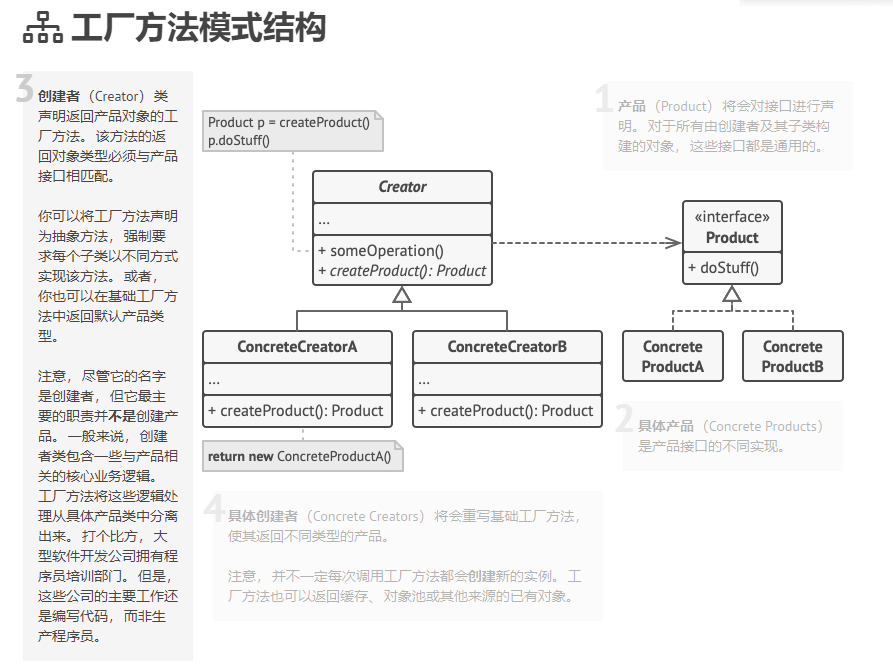

## 工厂方法
> 工厂方法模式是一种创建型设计模式， 其在父类中提供一个创建对象的方法， 允许子类决定实例化对象的类型。



### 伪代码
```java
// 创建者类声明的工厂方法必须返回一个产品类的对象。创建者的子类通常会提供
// 该方法的实现。
class Dialog is
    // 创建者还可提供一些工厂方法的默认实现。
    abstract method createButton():Button

    // 请注意，创建者的主要职责并非是创建产品。其中通常会包含一些核心业务
    // 逻辑，这些逻辑依赖于由工厂方法返回的产品对象。子类可通过重写工厂方
    // 法并使其返回不同类型的产品来间接修改业务逻辑。
    method render() is
        // 调用工厂方法创建一个产品对象。
        Button okButton = createButton()
        // 现在使用产品。
        okButton.onClick(closeDialog)
        okButton.render()


// 具体创建者将重写工厂方法以改变其所返回的产品类型。
class WindowsDialog extends Dialog is
    method createButton():Button is
        return new WindowsButton()

class WebDialog extends Dialog is
    method createButton():Button is
        return new HTMLButton()


// 产品接口中将声明所有具体产品都必须实现的操作。
interface Button is
    method render()
    method onClick(f)

// 具体产品需提供产品接口的各种实现。
class WindowsButton implements Button is
    method render(a, b) is
        // 根据 Windows 样式渲染按钮。
    method onClick(f) is
        // 绑定本地操作系统点击事件。

class HTMLButton implements Button is
    method render(a, b) is
        // 返回一个按钮的 HTML 表述。
    method onClick(f) is
        // 绑定网络浏览器的点击事件。


class Application is
    field dialog: Dialog

    // 程序根据当前配置或环境设定选择创建者的类型。
    method initialize() is
        config = readApplicationConfigFile()

        if (config.OS == "Windows") then
            dialog = new WindowsDialog()
        else if (config.OS == "Web") then
            dialog = new WebDialog()
        else
            throw new Exception("错误！未知的操作系统。")

    // 当前客户端代码会与具体创建者的实例进行交互，但是必须通过其基本接口
    // 进行。只要客户端通过基本接口与创建者进行交互，你就可将任何创建者子
    // 类传递给客户端。
    method main() is
        this.initialize()
        dialog.render()
```

