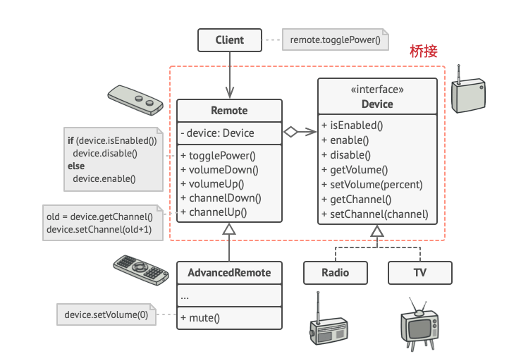

最初类层次结构被拆分为两个部分：设备和遥控器。

遥控器基类声明了一个指向设备对象的引用成员变量。所有遥控器通过通用设备接口与设备进行交互，使得同一个遥控器可以支持不同类型的设备。

你可以开发独立于设备类的遥控器类，只需新建一个遥控器子类即可。例如，基础遥控器可能只有两个按钮，但你可在其基础上扩展新功能，比如额外的一节电池或一块触摸屏。

客户端代码通过遥控器构造函数将特定种类的遥控器与设备对象连接起来。


```java
// “抽象部分”定义了两个类层次结构中“控制”部分的接口。它管理着一个指向“实
// 现部分”层次结构中对象的引用，并会将所有真实工作委派给该对象。
class RemoteControl is
    protected field device: Device
    constructor RemoteControl(device: Device) is
        this.device = device
    method togglePower() is
        if (device.isEnabled()) then
            device.disable()
        else
            device.enable()
    method volumeDown() is
        device.setVolume(device.getVolume() - 10)
    method volumeUp() is
        device.setVolume(device.getVolume() + 10)
    method channelDown() is
        device.setChannel(device.getChannel() - 1)
    method channelUp() is
        device.setChannel(device.getChannel() + 1)


// 你可以独立于设备类的方式从抽象层中扩展类。
class AdvancedRemoteControl extends RemoteControl is
    method mute() is
        device.setVolume(0)


// “实现部分”接口声明了在所有具体实现类中通用的方法。它不需要与抽象接口相
// 匹配。实际上，这两个接口可以完全不一样。通常实现接口只提供原语操作，而
// 抽象接口则会基于这些操作定义较高层次的操作。
interface Device is
    method isEnabled()
    method enable()
    method disable()
    method getVolume()
    method setVolume(percent)
    method getChannel()
    method setChannel(channel)


// 所有设备都遵循相同的接口。
class Tv implements Device is
    // ...

class Radio implements Device is
    // ...


// 客户端代码中的某个位置。
tv = new Tv()
remote = new RemoteControl(tv)
remote.togglePower()

radio = new Radio()
remote = new AdvancedRemoteControl(radio)
```